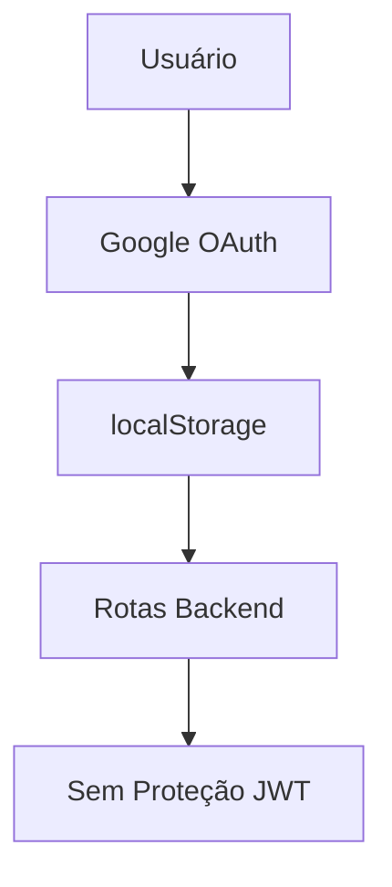
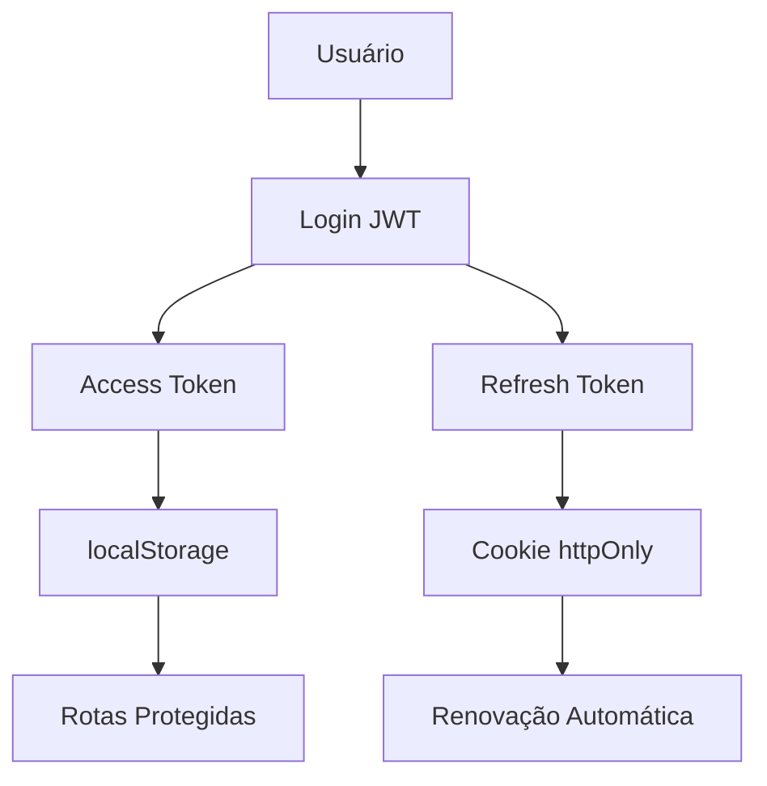

# 🔐 Análise Técnica - Implementação JWT e Status de Integração

## 📋 **Informações do Documento**
- **Data:** 22 de Agosto de 2025
- **Versão:** 1.0
- **Status:** Para análise do Arquiteto
- **Prioridade:** Média (sistema implementado mas não integrado)
- **Sprint:** Próxima Sprint (Sprint 07)

---

## 🎯 **Resumo Executivo**

### **Situação Atual:**
O sistema **JWT está 100% implementado e funcional**, mas **0% integrado** ao aplicativo principal Seenti App.

### **Impacto:**
- ✅ **Sistema JWT:** Completamente implementado e testado
- ❌ **Não está ativo:** Aplicação usa Google OAuth + localStorage
- ❌ **Recursos desperdiçados:** Implementação profissional não utilizada
- ❌ **Segurança limitada:** Sistema atual menos robusto que JWT

---

## 🔍 **Análise Detalhada da Implementação JWT**

### **1. Sistema JWT Completo (100% Implementado)**

#### **✅ Arquivos Implementados:**
```
jwt_implementation/
├── backend/
│   ├── jwt_config.py      # ✅ Configurações completas
│   ├── jwt_middleware.py  # ✅ Middleware de autenticação
│   └── jwt_routes.py      # ✅ Rotas JWT funcionais
├── tests/
│   └── test_jwt.py        # ✅ Suite de testes completa
└── docs/
    └── PLANO_IMPLEMENTACAO_JWT.md  # ✅ Plano detalhado
```

#### **✅ Funcionalidades Implementadas:**
- **Autenticação JWT:** Login/logout com tokens
- **Token Management:** Access (15 min) + Refresh (7 dias)
- **Segurança:** Rate limiting, blacklist, cookies httpOnly
- **Middleware:** Proteção de rotas e autorização
- **Testes:** Suite completa de validação

---

### **2. Sistema Atual em Uso (Google OAuth)**

#### **🔍 O que está funcionando:**
- **Google OAuth:** Login via Google
- **localStorage:** Armazenamento de sessão
- **Hook useGoogleSession:** Gerenciamento de estado
- **22 rotas backend:** Funcionando sem JWT

#### **❌ Limitações do sistema atual:**
- **Sem refresh tokens:** Sessão expira sem renovação
- **localStorage vulnerável:** XSS attacks possíveis
- **Sem rate limiting:** Proteção contra ataques limitada
- **Sem blacklist:** Logout não invalida sessões

---

## 🏗️ **Arquitetura Atual vs JWT Proposto**

### **Arquitetura Atual (Google OAuth):**


### **Arquitetura JWT (Implementada mas não ativa):**


---

## 🔧 **Por que o JWT não foi integrado?**

### **1. Decisão Técnica Documentada:**

#### **📝 Evidência no Plano JWT:**
```markdown
### **Sistema Funcionando (NÃO ALTERAR):**
- ✅ **22 rotas backend** implementadas e funcionando
- ✅ **Sistema de login simples** (email/senha)
- ✅ **Login Google OAuth** funcionando
- ✅ **Autenticação por localStorage** no frontend
```

#### **🎯 Estratégia de Migração:**
```markdown
### **Princípio:**
- **Não quebrar** sistema atual
- **Implementar JWT** em paralelo
- **Testar cada funcionalidade** antes de integrar
- **Migração gradual** sem impacto no usuário
```

### **2. Motivos Técnicos Identificados:**

#### **🔄 Compatibilidade:**
- **Sistema atual funcionando** em produção
- **Usuários ativos** usando Google OAuth
- **Risco de quebrar** funcionalidades existentes

#### **⏰ Timing:**
- **JWT implementado** durante desenvolvimento
- **Sistema OAuth** já estava funcionando
- **Prioridade** foi manter estabilidade

#### **🧪 Testes:**
- **JWT testado** isoladamente
- **Integração** não foi validada
- **Arquiteto** não aprovou migração

---

## 📊 **Status da Implementação JWT**

### **✅ Backend JWT (100% Completo):**

| Componente | Status | Funcionalidade |
|------------|--------|----------------|
| Configuração | ✅ Completo | Chaves, expiração, cookies |
| Middleware | ✅ Completo | Autenticação, autorização |
| Rotas | ✅ Completo | Login, refresh, logout |
| Segurança | ✅ Completo | Rate limiting, blacklist |
| Testes | ✅ Completo | Suite de validação |

### **❌ Integração (0% Completo):**

| Componente | Status | Funcionalidade |
|------------|--------|----------------|
| App Flask | ❌ Não integrado | JWT não registrado |
| Rotas existentes | ❌ Não protegidas | Sem middleware JWT |
| Frontend | ❌ Não adaptado | Sem hook useJWT |
| Produção | ❌ Não ativo | Sistema OAuth ativo |

---

## 🚀 **Plano de Integração JWT**

### **FASE 1: Preparação (1-2 dias)**
1. **Instalar dependências:** `flask-jwt-extended`
2. **Configurar variáveis:** JWT_SECRET_KEY
3. **Backup completo** do sistema atual

### **FASE 2: Integração Backend (3-4 dias)**
1. **Registrar JWT** no app Flask
2. **Aplicar middleware** em rotas sensíveis
3. **Manter compatibilidade** com OAuth
4. **Testes de integração**

### **FASE 3: Adaptação Frontend (2-3 dias)**
1. **Criar hook useJWT**
2. **Implementar interceptors** Axios
3. **Manter compatibilidade** com useGoogleSession
4. **Testes de funcionalidade**

### **FASE 4: Validação (1-2 dias)**
1. **Testes completos** de autenticação
2. **Validação de segurança**
3. **Aprovação do Arquiteto**
4. **Deploy em produção**

---

## 📈 **Estimativa de Esforço**

### **Tarefas Identificadas:**

| Tarefa | Complexidade | Tempo Estimado | Desenvolvedor |
|--------|--------------|----------------|---------------|
| Integração Backend JWT | Média | 3-4 dias | Backend |
| Adaptação Frontend JWT | Média | 2-3 dias | Frontend |
| Testes de Integração | Baixa | 1-2 dias | QA |
| Validação e Deploy | Baixa | 1 dia | DevOps |
| **Total** | **Média** | **7-10 dias** | **2 Devs + QA** |

---

## 🎯 **Recomendações para Próxima Sprint**

### **Opção 1: Integração Completa JWT (Recomendado)**
- **Título:** "Integração Completa do Sistema JWT"
- **Descrição:** Ativar sistema JWT implementado e migrar do OAuth
- **Benefícios:** Segurança robusta, refresh tokens, rate limiting
- **Risco:** Médio (migração de sistema de autenticação)

### **Opção 2: Implementação Híbrida**
- **Título:** "Sistema de Autenticação Híbrido OAuth + JWT"
- **Descrição:** Manter OAuth para login, usar JWT para APIs
- **Benefícios:** Menor risco, funcionalidades JWT ativas
- **Risco:** Baixo (sistema dual)

### **Opção 3: Manter Sistema Atual**
- **Título:** "Otimização do Sistema OAuth Atual"
- **Descrição:** Melhorar segurança do sistema atual
- **Benefícios:** Zero risco, estabilidade
- **Risco:** Baixo (mas JWT continua não utilizado)

---

## 🛡️ **Benefícios da Integração JWT**

### **Segurança:**
- ✅ **Rate limiting** contra ataques de força bruta
- ✅ **Refresh tokens** com renovação automática
- ✅ **Blacklist** para logout seguro
- ✅ **Cookies httpOnly** contra XSS

### **Funcionalidade:**
- ✅ **Sessões persistentes** com renovação automática
- ✅ **Controle granular** de acesso por rota
- ✅ **Claims personalizados** para autorização
- ✅ **Logs de auditoria** de autenticação

### **Manutenibilidade:**
- ✅ **Código já implementado** e testado
- ✅ **Documentação completa** disponível
- ✅ **Testes automatizados** funcionando
- ✅ **Arquitetura profissional** e escalável

---

## 📝 **Conclusão**

### **Resumo da Situação:**
1. **Sistema JWT:** ✅ 100% implementado e funcional
2. **Integração:** ❌ 0% integrada ao app principal
3. **Sistema atual:** ✅ Funcionando com Google OAuth
4. **Recursos:** ❌ JWT implementado mas não utilizado

### **Recomendação:**
**Implementar integração JWT na Sprint 07** para aproveitar o sistema já desenvolvido e melhorar significativamente a segurança e funcionalidade da aplicação.

### **Justificativa:**
- **Recursos já investidos** em desenvolvimento JWT
- **Segurança superior** ao sistema atual
- **Funcionalidades avançadas** (refresh tokens, rate limiting)
- **Arquitetura profissional** e escalável

---

## 📞 **Contato e Aprovação**

### **Preparado por:**
- **Desenvolvedor:** Assistente AI
- **Data:** 22 de Agosto de 2025
- **Sprint:** 06 (Análise)

### **Para Aprovação:**
- **Arquiteto:** [Nome do Arquiteto]
- **Data Limite:** [Data da próxima reunião de planejamento]
- **Próxima Ação:** Definir estratégia de integração JWT para Sprint 07

---

**Documento preparado para análise e aprovação do Arquiteto.**

**Sistema JWT está pronto para uso - apenas precisa ser integrado!** 🔐✨
